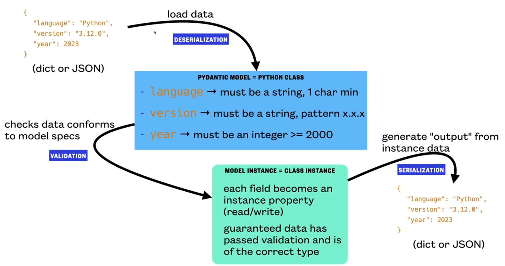

# 2. Basics

`Pydantic is a framework for defining specialized Python classes.`
- In pydantic we refer to attributes as Fields. They both are the same thing.
- The Specialized class created is called a model. `Pydantic models are just python classes`

`It provides a simple way to load data (from dict/JSON) into a model (Python class)`

- We go from a dict/JSON string to an object which we can manipulate.
- Its easier to work with data inside an object than data in a string. (OOP)
- Instances of those classes are called model instances
- Loading the data into the model (class) is called `deserializing` the data.
- Using Pydantic, we can also easily extract model instaces into JSON/dict. (`Serializing`).
### Data Validation
- Pydantic also provides a system to validate data during deserialization.
- Data classes dont provide data validation.
- Also enables to work with data in an OOP manner.

`Pydantic model allows us to define a python class that is going to make sure that when we load data into an instance of that class - the specified types and constraints - are on it.`

<center>

</center>

### Pydantic vs Data Classes
- Pydantic is easy, simple. We can achieve same with Data classes but it would be more work
- Data classes have better performance.
- If you dont need validation, dont use pydantic


### Pydantic Syntax
```python
from pydantic import BaseModel

class Model(BaseModel):
    language: str
    version: str
    year: int
```

```python
Model(language='Python', version='3.12', year=2023)
```
- Pydantic uses `inheritence` (BaseModel has pydantic's functionality) - you create classes which inherit from that

### dataclass Syntax

```python
from dataclasses import dataclass

@dataclass
class Model:
    language: str
    version: str
    year: int
```
```python
Model(language='Python', version='3.12', year=2023)
```
- dataclass is a `code generator`