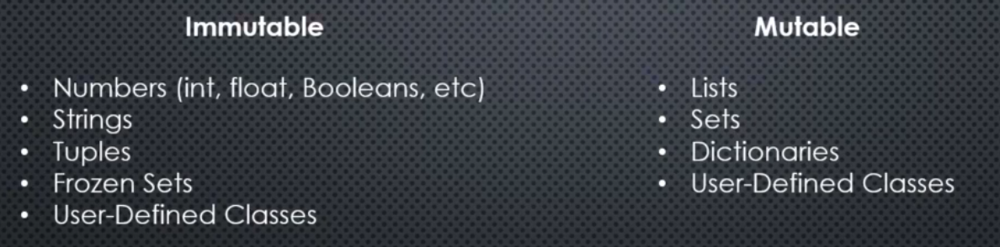
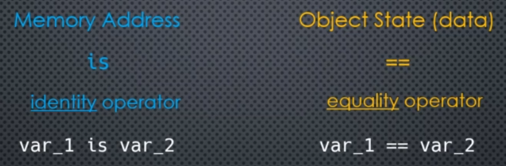

# 3. Variables & Memory

`Variables are memory references`

- Memory can be imagined as series of slots in our computer. We can receive and store data from those slots.
- We have a unique address for each slot. 


<center>

</center>

- Certain data may use multiple slots
- What is important to us is that where the object starts in memory
- This sequence of slots are called `Heap`. Storing and retreiving data from a heap is done by Python memory manager.

---
- Running `my_val = 10`, creates an object in memory and stores 10 in that object.
- `my_val` is a reference (is an alias) for the starting address of that object.
```python
hex(id(my_val)) # gives address of the variable 

sys.getrefcount(my_var) # gives reference count
```

- `other_var = my_var` means reference of my_var is assigned to other_var - other_var is also pointing to the same object in memory.
- Python memory manager does reference counting for us.

## Garbage Collection
As soon as reference count is 0, memory manager destoys that object and reclaims the memory - `BUT SOMETIMES THAT DOES NOT WORK!`

- Below my_var points to object A, which has an instance var_1 which points to object B.
- Deleting my_var, reference count of object A goes to 0.
- In this case, since reference count of object A =0 it will get destroyed, consequently reference count of object B = 0 hence it will also get destroyed.
- Removing my_var causes, Python memory manager will get rid of object A and B.

<center>

</center>

In case if object B also has an instance variable `val_2` which points back to object A - This case is known as `Circular Reference`.
- In this case even if we delete my_var reference, reference count of object A will be 1 (was 2 previously).
- If we leave like this, we will have a memory leak - memory manager cannot clean this
- This can only be cleaned by Garbage collection - by default garbage collection is turned on.
- Garbage collector can be controlled programmatically using the `gc` module.

<center>

</center>

## Dynamic vs Static Typing
### Static typing
- Programming languages which require a data type for a variable, are called statically typed languages.
- The data type is also associated with the variable, and the object also ofcourse.
- Java, C++ etc are statically typed

```java
String my_var = 10;

//later if we do this - this WONT work!!
my_var = 10; // will throw an error

// but this will work
my_var = "abc"; 
```
### Dynamic typing
- Python is dynamically typed. `my_var` would only be a reference to a string object.
- my_var does not have type, so it can reference an int later on.

## Object Mutability
- An object stored in a memory address has 2 things
    1. Type
    2. State
- Changing data `inside` the object is called `modifying the internal state of the object`
- Data is changed but memory address has not changed. `The object was mutated`. Internal state of the object changed.
- Object whose internal state can be changed are called mutable.
- Object whose internal state cannot be changed are called immutable.

- Tuples are immutable and if it has integers inside they are also immutable.

### Tuple containing lists
- If a tuple (immutable) contains lists (which are mutable), we can add elements to indiviual lists
- The memory address of individual lists remains same and can be edited.

## Function Arguments & Mutability
- If a function takes in a mutable object - it would be changed permanently. 

## Shared References
- For immutable objects, memory manager reuses memory references.
- With mutable objects, memory manager will never create shared references

## Variable Equality
Variable equality can be found by 2 ways:
1. Memory Address - are variables pointing to the same object
2. Object State (data) - The contents of 2 lists which may not be in the same memory address.

### Comparing Memory address 
```python
var_1 is var_2 # is not for opposite / not(var_1 is var_2)
```

### Comparing object state
```python
var_1 == var_2 # != for opposite
```


## None Object
- Can be assigned to variable to indicate that they are not set.
- But the none object is a real object that is managed by the memory manager. (Always will use shared reference when assigning a variable to `None`)

## Everything is an Object
`Objects are instances of Classes`
- Functions are instances of the function class/type
- Class is an instance of the class type
- Types (for e.g. INT) are also instance of class INT

`All of the things above have memory addresses`
- So functions also have a memory address
- `my_func` is the name of the function
- `my_func()` will invoke the function

## Optimizations Interning
1. `CPython` - written in C - standard
2. `Jython` - written in Java
3. `IronPython`
4. `PyPy` - python interpretor written in python which uses RPython - typed subset of python written in C