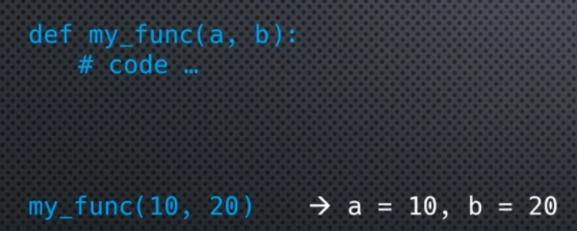
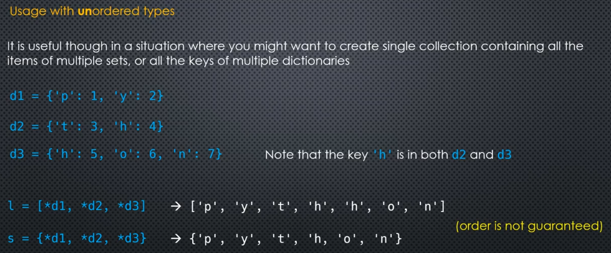
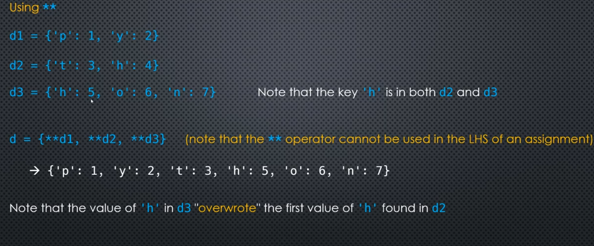

# 5. Function Parameters
## Argument vs Parameter
- When we call the function, the values which we put in are called arguments.
- When defining a function, the things in paranthesis are called parameters

```python
def my_func(a, b):
    # code
```

## Positional and Keyword Arguments
- Most common way of assigning arguments to parameters is via order they are passed in. i.e. `position`

<center>

</center>

- Default value can be set by using `=` sign. `def my_func(a=15, b=100)`
- If we assign a default value for a parameter, it becomes an `optional argument`.

## Keyword Arguments
- Used when we want to ommit argument(s)

## Unpacking Iterables
- Tuples are identified by `,` not by `()` -> `1, 2, 3` is also a tuple
- Tuple with a single element -> `(1,)` or `1,`
- Empty tuple -> `()` or `tuple()`
- Unpacking means splitting packed values into individual variables contained in a list.

```python
a, b, c = 1, 2, 3   # this is a tuple
a, b, c = 'XYZ'
```

### Unpacking a dictionary

```python
d = {
    'key1': 1,
    'key2': 2,
    'key3': 3,
}

a, b, c = d
```
- looping a dic, means iterating over its keys
- to get values we can use the `d.values()` method

## * Extended Unpacking

```python
l = [0, 1, 2, 3, 4, 5, 6]

a, b = l[0], l[1:]
# OR
a, *b = l
```
- The second method works for any iterable
- Whereas slicing works for indexable types e.g. sets and dictionaries
- The `*` operator can only be used `once` on the LHS

```python
l = [0, 1, 2, 3, 4, 5, 6]
a, b, *c, d = l

# a = 1, b = 2, c = [3, 4], d = 5
```

### Merging 2 lists using the * operator

```python
l1 = [1, 2, 3]
l2 = [4, 5, 6]

l = [*l1, *l2]
# [1, 2, 3, 4, 5, 6]
```

`In sets and dictionaries order is not preserved`
- So for this, convert and unpack dicts to lists first


## ** Unpacking Operator - unpack key-value pairs
